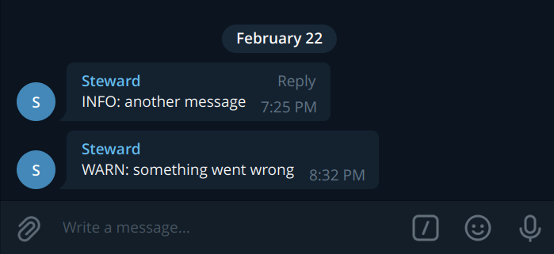

# snitch



Package snitch implements a thin wrapper around `zap` logger
that snitches log messages according to log level to specified
Telegram chat through your bot.
*Mainly meant for small projects.*

## Example Usage

```go
package main

import (
	"time"

	"github.com/barklan/snitch"
	"go.uber.org/zap"
)

func main() {
	logger, err := zap.NewDevelopment()
	if err != nil {
		panic(err)
	}

	sn, err := snitch.OnZap(logger, &snitch.Config{
		TGToken:   "50804fdfsf89383f3fxWu08889j9sdghopfuh8988FFFdI",
		// Telegram chat ID.
		TGChatID:  -438388543,
		// Level above which to send logs.
		Level:     snitch.InfoLevel,
		// Don't send the same message for 30 seconds.
		Cooldown:  30 * time.Second,
		// Adaptive Replacement Cache size for log events.
		CacheSize: 10,
	})
	if err != nil {
		panic(err)
	}

	for time := range time.Tick(1 * time.Second) {
		sn.Info("some info message", zap.Time("time", time))
	}
}
```
